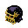

#  Jaggy [![NPM version][npm-image]][npm][![Bower version][bower-image]][bower] [![Build Status][travis-image]][travis] [![Coverage Status][coveralls-image]][coveralls]

## for gulp
```bash
$ npm install jaggy gulp
```

gulpfile.js

```js
var jaggy,gulp;
jaggy= require('jaggy');
gulp= require('gulp');
gulp.task('default',function(){
  gulp.src(['*.png','*.gif','*.jpg'])
    .pipe(jaggy())
    .pipe(gulp.dest('./'))
  ;
});
```

```bash
$ gulp # convert to .svg
```

## for browser
```bash
$ bower install jaggy
```

```html
<script src="bower_components/jaggy/sources/jaggy.browser.js"></script>
<script>
  jaggy('your_pixelart.png',function(error,svg){
    console.log(svg);//object: <svg version="1.1" ...>...</svg>
  });
</script>
```
***Doesn't work [Cross-origin][1]***

[1]: https://developer.mozilla.org/en-US/docs/Web/HTTP/Access_control_CORS

## for angular.js
```html
<head>
  <script src="bower_components/angular/angular.min.js"></script>
  <script src="bower_components/jaggy/sources/jaggy.browser.js"></script>
  <script>angular.module('myApp',['jaggy'])</script>
</head>
<body ng-app="myApp">
   <!-- replaceWith <svg> -->
</body>
```

## CLI
```bash
$ npm install jaggy -g
$ jaggy public_html
```

## Why?
Doesn't work [`image-rendering:crisp-edges`](http://caniuse.com/#feat=css-crisp-edges).
However, Can work on the [`<svg shape-rendering="crispEdges">`](http://caniuse.com/#feat=svg).
Gotcha, save the jaggy.

## Glitch option
`{glitch:int}`
### for gulp
```js
.pipe(jaggy({glitch:1}))
```
### for browser
```js
jaggy('your_pixelart.png',{glitch:2},function(error,svg){
```
### for angular.js
```html

```
### CLI
```bash
jaggy public_html -g 5
```

## Known issue
* Animated gif Can be convert, But, It's so very very heavy.

License
=========================
MIT by 59naga

[.svg]: https://cdn.rawgit.com/59naga/jaggy/master/.svg

[npm-image]: https://badge.fury.io/js/jaggy.svg
[npm]: https://npmjs.org/package/jaggy
[bower-image]: https://badge.fury.io/bo/jaggy.svg
[bower]: http://badge.fury.io/bo/jaggy
[travis-image]: https://travis-ci.org/59naga/jaggy.svg?branch=master
[travis]: https://travis-ci.org/59naga/jaggy
[coveralls-image]: https://coveralls.io/repos/59naga/jaggy/badge.svg?branch=master
[coveralls]: https://coveralls.io/r/59naga/jaggy?branch=master
